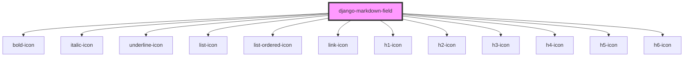

# django-markdown-field

<!-- Auto Generated Below -->

## Dependencies

### Depends on

- [bold-icon](../bold-icon)
- [italic-icon](../italic-icon)
- [underline-icon](../underline-icon)
- [list-icon](../list-icon)
- [list-ordered-icon](../list-ordered-icon)
- [link-icon](../link-icon)
- [h1-icon](../h1-icon)
- [h2-icon](../h2-icon)
- [h3-icon](../h3-icon)
- [h4-icon](../h4-icon)
- [h5-icon](../h5-icon)
- [h6-icon](../h6-icon)

### Graph

----------------------------------------------

*Built with [StencilJS](https://stenciljs.com/)*
